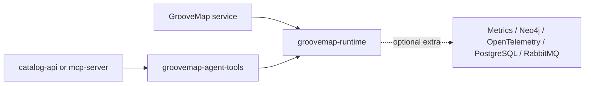

# GrooveMap Python libraries

MIT-licensed Python libraries shared by GrooveMap services. The `python-libraries`
repository owns two independently buildable distributions with one synchronized version:

| Distribution | Import surface | Responsibility |
| --- | --- | --- |
| `groovemap-runtime` | `common` | Health, logging, normalization, retries, and database/message-broker resilience |
| `groovemap-agent-tools` | `common.agent_tools` | Framework-neutral catalog query tools used by the API and MCP server |

The runtime's base install is dependency-light. Consumers select the `metrics`, `neo4j`,
`otel`, `otel-http`, `postgres`, or `rabbitmq` extra they need. `all` is intended for
development and validation.
Service-specific behavior, OAuth, deployment policy, credentials, and extraction state remain
the responsibility of each consuming application.



The supported interpreter line is Python 3.14, pinned to Python 3.14.7 in CI. Neither
distribution installs a console command. See the local package contracts for the complete
[runtime API](docs/runtime.md), [agent-tools API](docs/agent-tools.md), and
[compatibility and release policy](docs/compatibility-and-releases.md).

## Development

Install [mise](https://mise.jdx.dev/) and run:

```bash
mise install
just setup
just check
```

The supported recipe surface is grouped by purpose below. `just coverage` is the CI-facing alias
for the same test-and-coverage capability as `just test`; it does not maintain a second command
body.

| Purpose | Recipes |
| --- | --- |
| Discover and provision | `just` / `just default` lists recipes; `just setup` installs the locked workspace and all supported extras |
| Repair and local feedback | `just format` applies formatting and safe lint fixes; `just test-integration` exercises the live RabbitMQ integration path |
| Complete pre-merge gate | `just check` composes `format-check`, `lint`, `typecheck`, `test`, `automation-check`, `consumer-matrix-check`, `publication-readiness-check`, `media-taxonomy-check`, `build`, `distribution-check`, `install-check`, `license-check`, `secret-scan`, and `bump-preview` |
| CI capability aliases | `just coverage` delegates to `test`; the other individual check dependencies are supported for focused CI or developer diagnosis |
| Network and release rehearsal | `just audit` queries vulnerability data; `just release-dry-run` adds checksums, an SBOM, notices, and provenance after `check`; `just publication-readiness` adds `audit` and the final attestation |
| Approved version maintenance | `just bump` updates local version metadata, changelog, and lock data only |

Network access and publishing stay outside `just check`. `audit` needs current vulnerability
data, while `bump`, `release-dry-run`, and `publication-readiness` remain local-only; none publishes,
tags, pushes, or changes repository visibility.

The default `just test` and `just check` paths exclude tests marked `integration` and never
contact a broker. `just test-integration` runs `tests/test_rabbitmq_integration.py`; without
`RABBITMQ_HOST` it reports those live-broker tests as skipped. To run them locally, provide a
reachable RabbitMQ 4 management broker and the documented `RABBITMQ_*` test settings.

CI provisions a digest-pinned RabbitMQ 4 management container, waits for broker readiness,
and passes `just test-integration` through the reusable workflow's integration command. That
command is part of the single `required` job, so a heartbeat-negotiation or reconnect failure
blocks both ordinary and Dependabot pull requests with no actor-specific reduced path.

Both distributions' wheels and source archives are written directly to `dist/`. To prove that
the wheels work independently, run `just install-check`, which creates isolated temporary
environments and imports both packages from their built wheels. `just release-dry-run` also
generates SHA-256 checksums, a CycloneDX SBOM, third-party notices, and commit-bound local
provenance without publishing, tagging, or pushing anything.

From a clean reviewed commit, `just publication-readiness` runs the complete validation, audit,
and release rehearsal and writes an ignored, deterministic attestation to `dist/`. The
[publication-readiness guide](docs/publication-readiness.md) lists the visibility, anonymous-fetch,
credential-removal, and package-release approvals that remain external to repository validation.

## Vendored media taxonomy

`groovemap-runtime` ships the canonical media taxonomy that [ADR 0007 in the `design`
repository](https://github.com/groovemap-music/design/blob/main/docs/adr/0007-canonical-media-taxonomy.md)
makes authoritative for every GrooveMap service. `src/common/media_taxonomy/media-taxonomy.json`
is vendored verbatim, byte for byte, from `taxonomy/media/v1/media-taxonomy.json` in the
`design` repository; it ships as package data inside the `groovemap-runtime` wheel and is not
edited in this repository. `src/common/media_taxonomy/source.json` beside it records the
source commit and the vendored file's SHA-256 digest. `just check` runs
`scripts/check-media-taxonomy.py`, which recomputes that digest and fails if it differs from
`source.json` or if either file is missing — a drift means the vendored copy is stale.

To re-vendor after an upstream change: copy the new file from the reviewed `design` commit,
recompute its digest (`shasum -a 256 src/common/media_taxonomy/media-taxonomy.json`), and
update `source.json`'s `commit` and `sha256` fields to match. The same vocabulary is vendored
the same way into `discogs-ingestion` and `musicbrainz-ingestion`; keep all three in step with
the same reviewed `design` commit.

## Vendored identity vocabulary

`groovemap-runtime` ships the canonical identity vocabulary that [ADR 0009 in the `design`
repository](https://github.com/groovemap-music/design/blob/main/docs/adr/0009-native-identity-and-provider-aliases.md)
makes authoritative for every GrooveMap service. `src/common/identity_vocabulary/identity-vocabulary.json`
is vendored verbatim, byte for byte, from `taxonomy/identity/v1/identity-vocabulary.json` in
the `design` repository; it ships as package data inside the `groovemap-runtime` wheel and is
not edited in this repository. `src/common/identity_vocabulary/source.json` beside it records
the source commit and, per vendored file, its path and SHA-256 digest. `just check` runs
`scripts/check-identity-vocabulary.py`, which recomputes each digest and fails if it differs
from `source.json` or if the file is missing — a drift means the vendored copy is stale.

To re-vendor after an upstream change: copy the new file from the reviewed `design` commit,
recompute its digest (`shasum -a 256 src/common/identity_vocabulary/identity-vocabulary.json`),
and update `source.json`'s `commit` and the file's `sha256` field to match.

## Vendored event vocabulary

`groovemap-runtime` ships the canonical event vocabulary and JSON Schemas that [ADR 0010 in
the `design`
repository](https://github.com/groovemap-music/design/blob/main/docs/adr/0010-first-party-events-consent-and-deletion.md)
makes authoritative for every GrooveMap service. `src/common/event_vocabulary/event-types.json`,
`event-envelope.schema.json`, and `impression.schema.json` are vendored verbatim, byte for
byte, from `taxonomy/events/v1/` in the `design` repository; they ship as package data inside
the `groovemap-runtime` wheel and are not edited in this repository.
`src/common/event_vocabulary/source.json` beside them records the source commit and, per
vendored file, its path and SHA-256 digest. The conformance fixtures under
`taxonomy/events/v1/fixtures/` at the same commit are vendored the same way into
`tests/fixtures/events/`, with their own `source.json`. `just check` runs
`scripts/check-event-vocabulary.py`, which recomputes every recorded digest across both
`source.json` files and fails if any differs or if any file is missing — a drift means a
vendored copy is stale.

To re-vendor after an upstream change: copy every changed file from the reviewed `design`
commit, recompute each digest (`shasum -a 256 <file>`), and update the relevant `source.json`'s
`commit` and per-file `sha256` fields to match.

## Vendored identifier vocabulary

`groovemap-runtime` ships the canonical identifier vocabulary and block schema that [ADR 0011
in the `design`
repository](https://github.com/groovemap-music/design/blob/main/docs/adr/0011-catalog-identifiers-and-manufacturing-credits.md)
makes authoritative for every GrooveMap service.
`src/common/identifier_vocabulary/identifier-types.json`, `identifier-types.schema.json`, and
`identifier-block.schema.json` are vendored verbatim, byte for byte, from
`taxonomy/identifiers/v1/` in the `design` repository; they ship as package data inside the
`groovemap-runtime` wheel and are not edited in this repository.
`src/common/identifier_vocabulary/source.json` beside them records the source commit and, per
vendored file, its path and SHA-256 digest. The conformance fixtures under
`taxonomy/identifiers/v1/fixtures/` at the same commit are vendored the same way into
`tests/fixtures/identifiers/`, with their own `source.json`. `just check` runs
`scripts/check-identifier-vocabulary.py`, which recomputes every recorded digest across both
`source.json` files and fails if any differs or if any file is missing — a drift means a
vendored copy is stale.

To re-vendor after an upstream change: copy every changed file from the reviewed `design`
commit, recompute each digest (`shasum -a 256 <file>`), and update the relevant `source.json`'s
`commit` and per-file `sha256` fields to match.

## Vendored company-role vocabulary

`groovemap-runtime` ships the canonical company-role vocabulary and block schema that the same
ADR 0011 makes authoritative. `src/common/company_role_vocabulary/company-roles.json`,
`company-roles.schema.json`, and `company-block.schema.json` are vendored verbatim, byte for
byte, from `taxonomy/company-roles/v1/` in the `design` repository; they ship as package data
inside the `groovemap-runtime` wheel and are not edited in this repository.
`src/common/company_role_vocabulary/source.json` beside them records the source commit and, per
vendored file, its path and SHA-256 digest. The conformance fixtures under
`taxonomy/company-roles/v1/fixtures/` at the same commit are vendored the same way into
`tests/fixtures/company-roles/`, with their own `source.json`. `just check` runs
`scripts/check-company-role-vocabulary.py`, which recomputes every recorded digest across both
`source.json` files and fails if any differs or if any file is missing — a drift means a
vendored copy is stale.

To re-vendor after an upstream change: copy every changed file from the reviewed `design`
commit, recompute each digest (`shasum -a 256 <file>`), and update the relevant `source.json`'s
`commit` and per-file `sha256` fields to match.

## License and history

The current tree is licensed under the [MIT License](LICENSE). Its relevant source history was
preserved during repository extraction. Historical license revisions remain available in Git;
the source repository was not rewritten. The local [extraction record](docs/extraction.md)
contains the provenance details.

## Documentation

See the [documentation index](docs/README.md) for package contracts, compatibility, releases,
migration authentication, consumer compatibility evidence, and source-history provenance.
