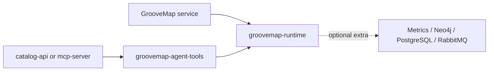

# GrooveMap Python libraries

MIT-licensed Python libraries shared by GrooveMap services. The `python-libraries`
repository owns two independently buildable distributions with one synchronized version:

| Distribution | Import surface | Responsibility |
| --- | --- | --- |
| `groovemap-runtime` | `common` | Health, logging, normalization, retries, and database/message-broker resilience |
| `groovemap-agent-tools` | `common.agent_tools` | Framework-neutral catalog query tools used by the API and MCP server |

The runtime's base install is dependency-light. Consumers select the `metrics`, `neo4j`,
`postgres`, or `rabbitmq` extra they need. `all` is intended for development and validation.
Service-specific behavior, OAuth, deployment policy, credentials, and extraction state remain
the responsibility of each consuming application.



The supported interpreter line is Python 3.14, pinned to Python 3.14.5 in CI. Neither
distribution installs a console command. See the local package contracts for the complete
[runtime API](docs/runtime.md), [agent-tools API](docs/agent-tools.md), and
[compatibility and release policy](docs/compatibility-and-releases.md).

## Development

Install [mise](https://mise.jdx.dev/) and run:

```bash
mise install
just setup
just check
```

The stable local interface is `just setup`, `just check`, `just test`, and `just build`.
`just test-integration` additionally requires a live RabbitMQ service. `just audit` uses
network vulnerability data and is intentionally separate from the pre-merge gate.

Both distributions' wheels and source archives are written directly to `dist/`. To prove that
the wheels work independently, run `just install-check`, which creates isolated temporary
environments and imports both packages from their built wheels. `just release-dry-run` also
generates SHA-256 checksums, a CycloneDX SBOM, third-party notices, and commit-bound local
provenance without publishing, tagging, or pushing anything.

From a clean reviewed commit, `just publication-readiness` runs the complete validation, audit,
and release rehearsal and writes an ignored, deterministic attestation to `dist/`. The
[publication-readiness guide](docs/publication-readiness.md) lists the visibility, anonymous-fetch,
credential-removal, and package-release approvals that remain external to repository validation.

## License and history

The current tree is licensed under the [MIT License](LICENSE). Its relevant source history was
preserved during repository extraction. Historical license revisions remain available in Git;
the source repository was not rewritten. The local [extraction record](docs/extraction.md)
contains the provenance details.

## Documentation

See the [documentation index](docs/README.md) for package contracts, compatibility, releases,
migration authentication, consumer compatibility evidence, and source-history provenance.
