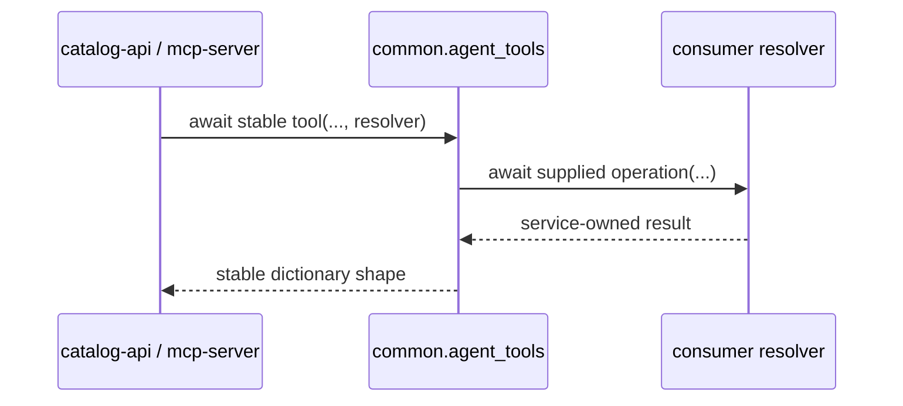

# `groovemap-agent-tools` contract

`groovemap-agent-tools` supplies framework-neutral async orchestration through
`common.agent_tools`. Its supported interpreter line is Python 3.14, pinned to Python 3.14.5 in
CI. It installs no console command and requires the exact same released version of
`groovemap-runtime`.

## Stable imports

The names in `common.agent_tools.__all__` are the stable public import surface.

| Capability | Stable names | Consumer supplies |
| --- | --- | --- |
| Discovery | `search` (with an optional `media` filter), `get_collaborators`, `get_trends` | Search, collaborator, or trend resolver plus its database handles |
| Entity details | `get_artist_details`, `get_genre_details`, `get_label_details`, `get_release_details`, `get_style_details` | Driver and entity handler |
| Graph traversal | `find_path` | Driver and path resolver |
| Graph summaries | `get_genre_tree`, `get_graph_stats` | Driver and summary resolver |

All functions are asynchronous. They adapt typed inputs and resolver results into stable
dictionary response shapes; they do not open connections, read credentials, select web
frameworks, or register API/MCP routes. Resolver implementations and application error policy
remain consumer responsibilities.

The package's submodules and helper type aliases are implementation details unless they are added
to `common.agent_tools.__all__` and documented here.

## Media filter and typed media

`search` accepts an optional `media` list holding family or medium ids from the canonical media
taxonomy that [ADR 0007 in the `design`
repository](https://github.com/groovemap-music/design/blob/main/docs/adr/0007-canonical-media-taxonomy.md)
defines, for example `["vinyl", "optical_cd"]`. The ids are validated against the taxonomy
before the query runs, so an agent that invents a medium gets one `ValueError` naming every
unknown id rather than an empty result set that reads as "no such records". Validate a filter
ahead of a call with `common.agent_tools.discovery.validate_media_filter`, and enumerate the
accepted ids with `common.family_ids()` and `common.medium_ids()`.

A validated filter reaches the consumer's search resolver as a `media` keyword argument, which
the catalog-api search route sends on as repeated `media` query parameters. `None` and an empty
list both mean "no media filter", and in that case `media` is not passed to the resolver at all,
so a consumer whose search implementation predates the parameter keeps working until it adds
one.

`get_release_details` passes through the `media` key a release carries, exactly as the store
holds it. It is the canonical media block, typed as `MediaBlock` in
`common.agent_tools.schemas` alongside `MediaItem`, `MediaSource`, and `MediaUnmapped`. The key
is absent for a release written before the block existed, so read it with
`common.agent_tools.entities.media_of`, which returns the typed block or `None`. Derive a
best-effort block from the legacy format names with `common.legacy_format_names_to_media` when
one is needed and none is stored.

## Compatibility boundary

Agent tools and runtime are versioned together. A release is valid only when both PEP 621 versions
match and `groovemap-agent-tools` pins `groovemap-runtime` to that exact version. See the repository
[compatibility and release policy](compatibility-and-releases.md).
