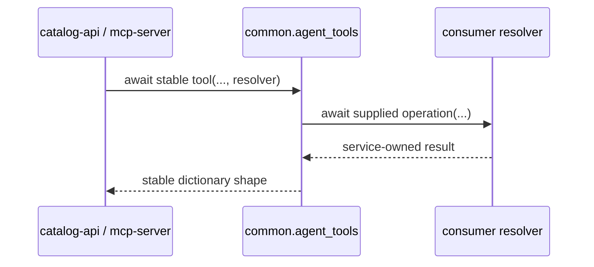

# `groovemap-agent-tools` contract

`groovemap-agent-tools` supplies framework-neutral async orchestration through
`common.agent_tools`. It supports Python 3.13 or later, installs no console command, and requires
the exact same released version of `groovemap-runtime`.

## Stable imports

The names in `common.agent_tools.__all__` are the stable public import surface.

| Capability | Stable names | Consumer supplies |
| --- | --- | --- |
| Discovery | `search`, `get_collaborators`, `get_trends` | Search, collaborator, or trend resolver plus its database handles |
| Entity details | `get_artist_details`, `get_genre_details`, `get_label_details`, `get_release_details`, `get_style_details` | Driver and entity handler |
| Graph traversal | `find_path` | Driver and path resolver |
| Graph summaries | `get_genre_tree`, `get_graph_stats` | Driver and summary resolver |

All functions are asynchronous. They adapt typed inputs and resolver results into stable
dictionary response shapes; they do not open connections, read credentials, select web
frameworks, or register API/MCP routes. Resolver implementations and application error policy
remain consumer responsibilities.

The package's submodules and helper type aliases are implementation details unless they are added
to `common.agent_tools.__all__` and documented here.

## Compatibility boundary

Agent tools and runtime are versioned together. A release is valid only when both PEP 621 versions
match and `groovemap-agent-tools` pins `groovemap-runtime` to that exact version. See the repository
[compatibility and release policy](compatibility-and-releases.md).
