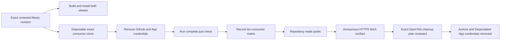

# Consumer compatibility and credential-removal gate

**Public-library cutover: complete.** Current consumers resolve `python-libraries` over
credential-free public HTTPS at immutable revisions. The machine-readable
[consumer matrix](consumer-compatibility.json) is retained as pre-cutover evidence: it records the
exact library revision and exact revisions of the ten repositories that previously used
temporary private-library credentials. Each consumer's complete `just check` gate was rehearsed
with the credential variables removed and with both distributions resolved from the recorded
library commit.

The rehearsal changes only the Git transport inside a disposable clone. It replaces the public
HTTPS repository URL with a local Git URL, preserving the exact commit, package names, extras,
lockfile shape, and full consumer validation command.

The overlay is committed inside the disposable clone under a conventional subject before the
consumer gate runs. A reviewed consumer revision generally predates its own repository's latest
release tag, so a detached checkout of it has an empty `<tag>..HEAD` range and a consumer's
release-preview step reports that it found no commits; an uncommitted overlay also leaves the
tree dirty, which is not a state any consumer gate is written for. Committing the overlay gives
the release preview exactly one new commit to classify and gives the gate a clean tree. The
committed content is byte-identical to the overlay, and no consumer check is relaxed or skipped. This separates package compatibility from
the repository's then-private visibility and preserves the pre-publication result reproducibly.
The repository-local distribution gate still installs both built wheels in clean environments
without any GitHub credential.



## Reproduce the evidence

From this repository's reviewed worktree, with the sibling consumer repositories available under
one workspace directory:

```bash
python scripts/verify-consumer-compatibility.py \
  --workspace /path/to/groovemap-music
```

The verifier refuses a changed library package tree, a missing consumer commit, a consumer whose
declared public source or lockfile does not contain its recorded immutable revision, or any matrix
that widens the ten-repository scope. It removes `GH_TOKEN`, `GITHUB_TOKEN`,
`GROOVEMAP_CI_APP_CLIENT_ID`, and `GROOVEMAP_CI_APP_PRIVATE_KEY` from each subprocess and disables
interactive Git prompting. It never writes to the source consumer checkout.

Run `just consumer-matrix-check` for the portable repository-local matrix and package-tree checks.
That command does not require sibling repositories and is part of `just check`.

## Completed infra handoff

Credential removal was deliberately not performed by this repository. After
`python-libraries` became public, infra proved an anonymous HTTPS fetch resolved the library
revision in the matrix and applied a separately reviewed OpenTofu plan that removed, for exactly
the matrix's consumer set:

- `github_actions_variable.ci_app_client_id`;
- `github_actions_secret.ci_app_private_key`;
- `github_dependabot_secret.ci_app_private_key`.

The matrix deliberately keeps `credential_removal.performed` false because it is an immutable
pre-cutover evidence snapshot, not a live infrastructure-status document. The public cutover and
credential cleanup completed outside this repository through their own operator-approved plans.
