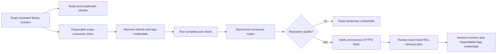

# Consumer compatibility and credential-removal gate

The machine-readable [consumer matrix](consumer-compatibility.json) records the exact
`python-libraries` revision and exact revisions of the ten repositories that currently need
temporary private-library credentials. Each consumer's complete `just check` gate is rehearsed
with the credential variables removed and with both distributions resolved from the recorded
library commit.

The rehearsal changes only the Git transport inside a disposable clone. It replaces the public
HTTPS repository URL with a local Git URL, preserving the exact commit, package names, extras,
lockfile shape, and full consumer validation command. This separates package compatibility from
the repository's current private visibility and makes the result reproducible before publication.
The repository-local distribution gate also installs both built wheels in clean environments
without any GitHub credential.



## Reproduce the evidence

From this repository's reviewed worktree, with the sibling consumer repositories available under
one workspace directory:

```bash
python scripts/verify-consumer-compatibility.py \
  --workspace /path/to/groovemap-music
```

The verifier refuses a changed library package tree, a missing consumer commit, a consumer whose
declared public source or lockfile does not contain its recorded immutable revision, or any matrix
that widens the ten-repository scope. It removes `GH_TOKEN`, `GITHUB_TOKEN`,
`GROOVEMAP_CI_APP_CLIENT_ID`, and `GROOVEMAP_CI_APP_PRIVATE_KEY` from each subprocess and disables
interactive Git prompting. It never writes to the source consumer checkout.

Run `just consumer-matrix-check` for the portable repository-local matrix and package-tree checks.
That command does not require sibling repositories and is part of `just check`.

## Infra handoff

Credential removal is deliberately not performed by this repository. After `python-libraries`
becomes public, infra must first prove an anonymous HTTPS fetch resolves the library revision in
the matrix. It may then produce a separately reviewed OpenTofu plan that removes, for exactly the
matrix's consumer set:

- `github_actions_variable.ci_app_client_id`;
- `github_actions_secret.ci_app_private_key`;
- `github_dependabot_secret.ci_app_private_key`.

The matrix keeps `credential_removal.performed` false. A visibility change or credential deletion
requires its own operator-approved plan; this compatibility evidence grants neither.
