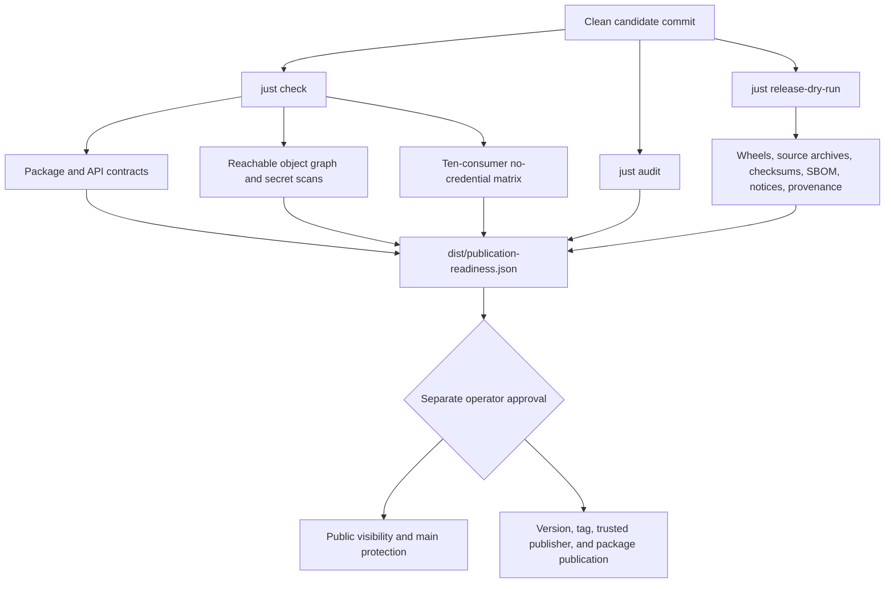

# Publication readiness

The repository can produce a deterministic, commit-bound readiness attestation without publishing
anything. The attestation combines the reviewed package contracts, immutable shared automation,
release artifacts, ten-consumer no-credential matrix, licenses, security checks, active GrooveMap
identity, and the complete Git object graph reachable from the candidate revision.



Run the complete local rehearsal only from a clean reviewed commit:

```bash
just publication-readiness
```

The ignored `dist/publication-readiness.json` records the exact commit and tree, every reachable
object's type, public-contract and workflow digests, release artifact checksums, SBOM and notices
counts, and the exact consumer evidence revision. It contains no timestamp, so the same commit and
artifacts produce byte-identical evidence.

`gitleaks git` scans the candidate's reachable history and `gitleaks dir` scans the current tree.
The readiness check independently enumerates every object reachable from the candidate commit and
rejects raw planning paths, secret directories, environment files, and private-key file names.
The sanitized source-repository name in `docs/extraction.md` is provenance, not active branding or
private planning material.

## External approval gates

Local readiness does not authorize any remote mutation. The attestation leaves each of these gates
explicitly unapproved:

1. Change repository visibility to public and protect `main` through the separately reviewed
   infrastructure change.
2. From an unauthenticated environment, fetch the attested commit over public HTTPS.
3. Revalidate the consumer matrix, review an exact OpenTofu plan, and separately approve removal
   of the temporary private-library Actions and Dependabot credentials.
4. Separately approve the version bump, annotated tag, trusted publisher, and package registry
   publication.

The readiness command never commits, tags, pushes, publishes, changes visibility, or removes a
credential. Generated evidence remains ignored under `dist/`.
